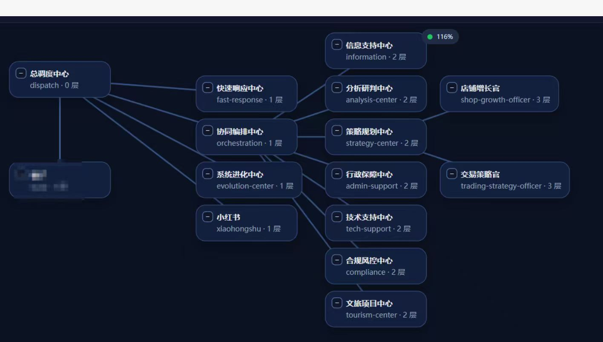

<div align="center">

# 🧬 Tyranid Hive

**受泰伦虫族启发的多 Agent 编排框架**

默认单主脑处理日常任务，自动升级为分层虫群处理复杂任务。

<br>

<p align="center">
  <a href="#-核心主张">💡 核心主张</a> ·
  <a href="#-四种执行模式">🎯 执行模式</a> ·
  <a href="#-核心机制">🧬 核心机制</a> ·
  <a href="#-快速开始">🚀 快速开始</a> ·
  <a href="#-社区生态">🌐 社区生态</a>
</p>

<p align="center">
  
  
  
  
</p>

</div>

---

## 💡 核心主张

**主张一：正确的默认态是单主脑，不是多 Agent。**

绝大多数任务根本不需要多 Agent 协调——加多个 Agent 只会增加延迟和出错率。Hive 默认以单主脑完成任务，只在满足明确条件时才升级到虫群模式。

**主张二：Submind 是域内 CEO，不是领域专家工具人。**

传统多 Agent 框架把每个 Agent 设计成"只懂一件事"的专家，跨域问题必须通过"协调者"中转。Hive 的 Submind 有完整推理能力，只是执行边界在自己的领域——跨域问题直接 @对方 Submind 协商，主脑不做翻译官。

> **一句话**：公司制是虫巢在已知业务域下进化到成熟期后的人工快照。虫巢能生长出公司制，但公司制无法自动演化成虫巢。

---

## 🎯 四种执行模式

主脑收到任务后**先判断问题结构，再选模式**：

```
用户输入
  ↓
主脑判断执行模式
  ├─ 顺序工具链 / 日常问答       →  Solo Mode（单主脑直接做）
  ├─ 真正可并行的竞争路径         →  Trial 赛马（双路竞争取优）
  ├─ 线性依赖的系统重构           →  Chain Mode（串行链，精裁 context）
  └─ 完全独立的批量任务           →  Swarm Mode（并发 Unit 池）
```

| 问题结构 | 模式 | 典型例子 |
|----------|------|----------|
| 有约束的决策（结果可客观比较） | Trial + 多 CEO | 技术选型、收益模型方案 |
| 有线性依赖的执行 | Chain + CEO | 系统重构（P1→P2→P3） |
| 开放式创意探索 | Swarm + 视角注入 | 经济体系设计、头脑风暴 |
| 单路顺序工具链 | Solo | 日常问答、简单自动化 |

**关键设计**：模式选择不看"复不复杂"，看问题结构。赛马前必须做 ~500 token 快速论证——推理能解决就不开赛。

---

## 🎬 Demo

### Demo 1：每日 9 点股票早报 — 系统越成熟效率越高

**Tier 1 — 细胞期**（刚跑通）
```
09:00  cron 触发

[主脑] 顺序工具链 → Solo Mode
  → 搜索财经新闻（串行）→ 拉行情 API（串行）→ LLM 综合推理

09:02:30  输出早报
         ↓ 进化大师复盘 → 落盘 Lessons
```

**Tier 3 — 文明期**（Swarm 并行 + Playbook 积累）
```
09:00  cron 触发

[主脑] 采集任务独立 → Swarm 并行

  [Unit 新闻]              [Unit 行情]        ← 并行
  拉 RSS + LLM 摘要         调 API + 归一化

           ↓ 均完成后 → 合成调仓建议

09:01:20  输出（快 ~1 分钟；Playbook 已积累过滤规则）
         ↓ 进化大师复盘 → 更新 Playbook 版本
```

**Tier 4 — 太空期**（专化形态直接孵化）
```
09:00  cron 触发

[主脑] 识别「每日股票早报」→ 调用成熟专化形态

  [专化新闻虫]             [专化行情虫]       ← 并行
  预装最优 RSS 源           预装 API 端点
  + Playbook 过滤规则       + 数据归一化模板

           ↓ 完成后 → 专化推荐主脑（30 天蒸馏）

09:00:45  输出（快 ~45 秒；token 消耗 -60%）
         ↓ 进化大师持续监测 → 退化则回收重探索
```

### Demo 2：Trial Mode — 爬虫赛马

```
用户: "帮我写个爬虫抓取豆瓣 Top250"

[主脑判断] 多可行路径 + 历史失败率高 → Hive Mode
[赛马前置论证] requests vs playwright 无法推理出优劣 → 开 Trial
           ↓
[主频道 · Trunk]────────────────────────────────────────────────
│ [主脑]     双路并行：Submind-Code-A / Code-B
│ ...
│ [主脑]     Trial 完成，选择方案B（成功率更高）
│ [进化大师] 复盘落盘：方案A反爬不足→Lessons；方案B动态等待→Playbook
│ [系统]     Submind-Code-B 生物质收割 +3
├───────────────────────────────────────────────────────────────

[Trial 面板 · 折叠]─────────────────────────────────────────────
│ ├─ Submind-A · requests    成功率 95% · 评分 82.1
│ └─ Submind-B · playwright  成功率 98% · 评分 89.4  ← 胜者
└───────────────────────────────────────────────────────────────
```

### Demo 3：Chain Mode — 系统性重构

```
任务: "实现 M6.3 经济重构（P1→P2→P3→P4→P5）"

[主脑判断] 线性依赖 → Chain Mode
           ↓
Submind-P1（精裁 context：P1 spec + 现有 DB schema）
  → 实现四维属性 → 输出改动摘要

Submind-P2（P2 spec + P1 改动摘要）
  → 实现副业系统 → ...

每阶段精裁 context，阶段间传递"改动摘要"而非完整代码
         ↓ 全链完成
[进化大师] 复盘全链 → 提炼跨阶段模式 → 更新 Playbook
```

> **所有执行模式完成后都经过进化大师复盘**——Solo/Trial/Chain/Swarm 无一例外，区别只在于复盘深度和落盘层级。

---

## 🧬 核心机制

### 等级制

| 层级 | 角色 | 职责 |
|:---:|:---|:---|
| **L3** | 🧠 主脑 · Overmind | 执行模式判断、赛马仲裁、任务收敛 |
| **L3** | 🔬 进化大师 · Evolution Master | 基因进化、赛后复盘、专化形态结晶 |
| **L2** | 🎯 小主脑 · Submind | 域内 CEO：全局推理 + 本域执行 + 跨域协商 |
| **L1** | 🐛 虫群组 · Brood | 动态协作执行组（Swarm Mode） |
| **L0** | ⚔️ 单位 · Unit | 专业执行者 + ToolAction |

```
                    ┌─────────────┐
                    │   👤 宿主   │
                    └──────┬──────┘
                           │
                    ┌──────▼──────────────────────────┐
                    │  🧠 主脑 · Overmind (L3)         │
                    │  执行模式判断 · 赛马仲裁 · 收敛   │
                    └──────┬──────────────────────────┘
                           │
          ┌────────────────┼─────────────────┐
          ↓ Trial Mode     ↓ Chain Mode       ↓ Solo Mode
    ┌──────────┐    ┌──────────────┐    ┌──────────────┐
    │Submind-A │    │ Submind-P1   │    │ 主脑直接执行  │
    │Submind-B │    │ Submind-P2   │    │ 工具链串行    │
    │(并行竞争)│    │ (串行接棒)   │    │              │
    └────┬─────┘    └──────┬───────┘    └──────┬───────┘
         │                 │                    │
         └─────────────────┼────────────────────┘
                           ↓
    ┌──────────────────────────────────────────┐
    │  🔬 进化大师 · Evolution Master (L3)     │
    │  所有模式完成 → 复盘 → 落盘基因          │
    └──────────────────────────────────────────┘
```

### 适存驱动（Fitness Drive）

不显式定义目标函数——用**生物质消耗 + 收割的张力**自然涌现优化方向：

```
生物质消耗（Drain）  = 待机 + 执行 + 协调 的 token/时间成本
生物质收割（Harvest） = 任务完成 + 用户反馈 + Trial 胜出 + 进化贡献
生物质净值（Net）    = 收割 − 消耗

净值 > 0 → 领域扩张    净值 ≈ 0 → 稳定运行    净值 < 0 → 休眠回收
```

### 三层基因注入

| 层级 | 名称 | 特点 |
|:---|:---|:---|
| **L1** | Constitution（宪法） | 直灌 prompt，强制加载，极少更新 |
| **L2** | Playbook（战术手册） | 检索注入 Top-K，版本化管理，进化大师主导 |
| **L3** | Lessons（近期教训） | 30 天时效，自然衰减，越用越精确 |

Unit 启动时**强制加载基因**，失败则无法启动。任务失败**强制写入 Lessons**，不能跳过。经验不可被忽略，写了就会被用到。

### 进化大师 · Evolution Master

灵感来自泰伦虫族诺恩后虫 + 异虫阿巴瑟——系统唯一专职负责进化的角色：

- **受限独立意志**：在进化领域可自主判断，但不得绕过主脑调度
- **复盘两阶段**：Reflect（诊断根因）→ Write（更新基因），不允许合并跳过
- **专化形态结晶**：探索期 → 积累 Playbook → 蒸馏为专化形态（低开销，高可靠）
- **Skill 自合成**：消化外来工具 → 适应分析 → 合成虫巢独有的定制 Skill

> 公司制用的是"买来的刀"，虫巢用的是"从每次战斗中磨出的刀，最终锻造出原版没有的新兵器"。

### 条件赛马（Conditional Trial）

满足 2 项以上触发条件 + 通过前置论证才开赛：

| 触发条件 | 说明 |
|----------|------|
| 需要外部执行 | 涉及浏览器/桌面/API 等外部操作 |
| 存在多可行路径 | 技术方案不唯一且推理无法判优 |
| 高风险操作 | 数据修改、安全敏感、不可回滚 |
| 历史失败率高 | 同 domain 近 7 天失败率 > 30% |

收敛两层判据：硬门槛（全部通过才进入评分）→ 软评分（质量 40% / 速度 20% / 健壮性 15% / 复用 10% / Token -10% / 协调 -5%）

---

## ⚔️ 对比

| 特性 | CrewAI | MetaGPT | AutoGen | **Tyranid Hive** |
|:---|:---|:---|:---|:---|
| **默认执行模式** | 多 Agent | 多 Agent | 多 Agent | **Solo Mode（按需升级）** |
| **Agent 模型** | 专家工具人 | 专家工具人 | 平等协商 | **域内 CEO（全局推理）** |
| **复杂任务** | 单路径 | 单路径 | 单路径 | **四种模式自动匹配** |
| **赛马机制** | 无 | 无 | 无 | **赛前论证 + 条件触发** |
| **Agent 进化** | ❌ | ❌ | ❌ | **适存驱动（生物质 P&L）** |
| **经验沉淀** | 记忆 | 记忆 | 上下文 | **三层基因强制注入** |
| **进化管理** | 无 | 无 | 无 | **进化大师专职负责** |

---

## 🚀 快速开始

### 安装

```bash
# 前置条件：Python 3.10+ · Claude Code CLI
npm i -g @anthropic-ai/claude-code

git clone https://github.com/zuiho-kai/tyranid-hive.git
cd tyranid-hive
pip install -e ".[dev]"
```

### 启动

```bash
python start.py          # 默认 http://localhost:8765
# 或
docker-compose up        # Docker 一键启动
```

### 使用

```bash
# CLI
hive tasks create "实现斐波那契函数" --priority high
hive tasks trial <task_id> --synapses code-expert,research-analyst

# API
curl -X POST http://localhost:8765/api/tasks \
  -H "Content-Type: application/json" \
  -d '{"title": "实现斐波那契函数", "description": "需要递推和记忆化两种版本"}'
```

Dashboard：http://localhost:8765/dashboard

> 详细上手指南：[docs/getting-started.md](docs/getting-started.md)

---

## 🌐 社区生态

### 基于 Hive 方法论的项目

<table>
  <tr>
    <td width="50%">
      <h4><a href="https://github.com/jsk11231/openclaw-agent-console-bilingual">OpenClaw Agent Console (Bilingual)</a></h4>
      <p>基于 Tyranid Hive 方法论的<strong>简化实现版</strong>——保留核心的分层调度与域内 CEO 模型，提供开箱即用的中英双语 Agent 控制台。适合想快速体验虫巢编排思想、不需要完整进化机制的场景。</p>
      
    </td>
  </tr>
</table>

如果你基于 Hive 方法论做了自己的实现，欢迎 PR 添加到这里。

---

## 🗺️ Roadmap

| 阶段 | 状态 | 关键内容 |
|------|:---:|---------|
| **Phase 1 — 神经觉醒** | ✅ | 任务状态机、FastAPI REST API、事件总线、三层基因库、Trial 赛马、Overmind 分析、React Dashboard、CLI、Docker、242 个测试 |
| **Phase 2 — 虫巢扩张** | 🚧 | 统计仪表盘、Chain Mode、Evolution Master 自动萃取、PostgreSQL 迁移 |
| **Phase 3 — 星际航行** | 📋 | 跨 Hive 协作、基因市场、多视角决策层 |

---

## 🙏 致谢

| 项目 | 贡献 |
|:---|:---|
| [OpenClaw](https://github.com/OpenClaw) | 框架基础 |
| [cat-cafe-tutorials](https://github.com/zts212653/cat-cafe-tutorials) | 三猫制度 · 域内 CEO 协作模型灵感 |
| [edict](https://github.com/cft0808/edict) | 三省六部制灵感 |
| [Greyfield](https://github.com/zuiho-kai/greyfield) | 宿主系统 |
| [Stellaris](https://store.steampowered.com/app/281990/Stellaris/) | 灰蛊风暴美学 |

---

<div align="center">

**In the Hive, every agent is a CEO of its domain. The swarm optimizes itself.**

> *"消耗即存在，收割即进化，净值即命运。"*
>
> *—— 进化大师 · Evolution Master*

</div>

---

## 📜 协议

MIT License
