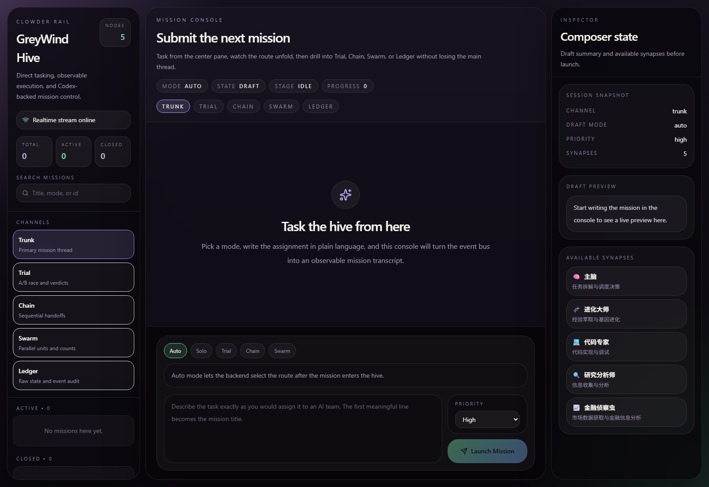
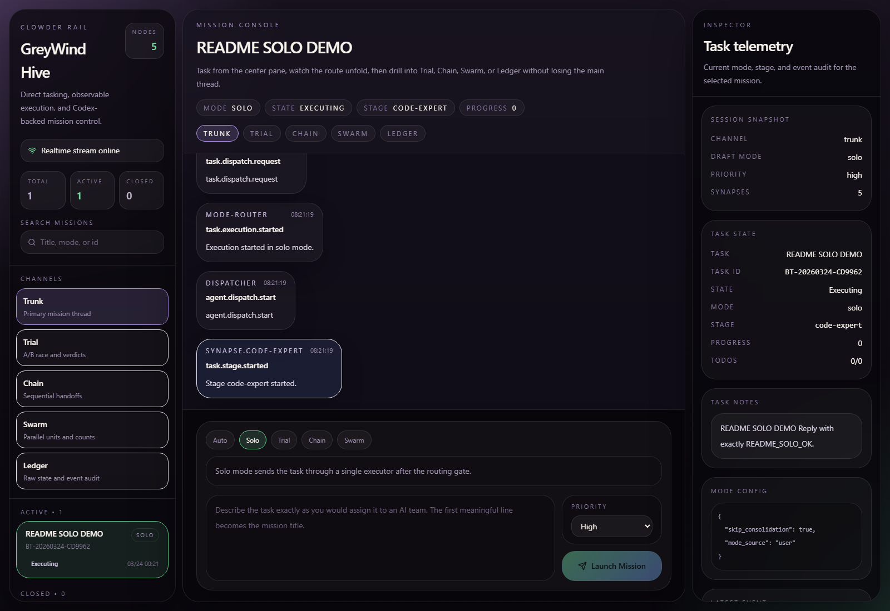
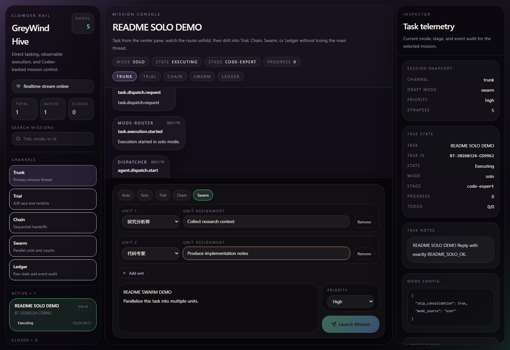

<div align="center">

# 🧬 Tyranid Hive

**受泰伦虫族 + 星际争霸异虫启发的多 Agent 编排框架**

默认以单主脑处理日常任务，自动升级为分层虫群处理复杂任务——不论普通用户还是开发者，都能无感知地用到正确的执行模式。

<br>

<p align="center">
  <a href="#-demo">🎬 Demo</a> ·
  <a href="#-为什么选-hive">💡 为什么选 Hive</a> ·
  <a href="#️-架构">🏛️ 架构</a> ·
  <a href="#-核心机制">🧬 核心机制</a> ·
  <a href="#️-对比">⚔️ 对比</a> ·
  <a href="#-快速开始">🚀 快速开始</a>
</p>

<p align="center">
  
  
  
  
  
</p>

</div>

---

## 这是什么？

**Tyranid Hive** 是一个多 Agent 编排框架，设计上有两个核心主张：

**主张一：正确的默认态是单主脑，不是多 Agent。**

绝大多数任务（搜索、问答、工具调用链）根本不需要多 Agent 协调——加多个 Agent 只会增加延迟和出错率。Hive 默认以单主脑直接完成任务，只有在满足明确条件时才升级到虫群模式。

**主张二：Submind 是域内 CEO，不是领域专家工具人。**

传统多 Agent 框架把每个 Agent 设计成"只懂一件事"的专家，跨域问题必须上报"协调者"中转。Hive 的 Submind 有完整的推理能力（能读懂全局），只是执行边界在自己的领域——遇到跨域问题直接 @对方 Submind 协商，主脑不做翻译官。

```
用户输入
  ↓
主脑判断执行模式
  ├─ 顺序工具链 / 日常问答   →  Solo Mode（单主脑直接做）
  ├─ 真正可并行的竞争路径   →  Trial 赛马（双路竞争取优）
  ├─ 线性依赖的系统重构     →  Chain Mode（串行链，精裁 context）
  └─ 完全独立的批量任务     →  Swarm Mode（并发 Unit 池）
```

---

## 💡 为什么选 Hive？

### 传统多 Agent 框架的问题

| 问题 | 表现 |
|------|------|
| 盲目多 Agent | 简单任务也走多 Agent 流程，慢且不稳定 |
| 专家工具人 | Agent 只懂自己的域，跨域必须通过"协调者"中转，协调者成为瓶颈 |
| 无目标函数 | Agent 优化什么、何时进化、何时淘汰，没有自洽的驱动机制 |
| 经验流失 | 教训停留在上下文，下次照犯 |
| 赛马滥用 | 路径唯一的任务也开双路，浪费两倍资源 |

### Tyranid Hive 的回答

| 机制 | 实现 | 收益 |
|------|------|------|
| **双模架构** | Solo Mode（默认）自动升级到 Hive Mode | 普通用户零感知，开发者用到完整虫群能力 |
| **四种执行模式** | Solo / Trial / Chain / Swarm 按任务形态自动匹配 | 每种任务走最合适的路径，不浪费资源 |
| **阿米巴 CEO** | Submind 有全局推理能力，只在本域执行 | 跨域直接 @对方，消灭协调瓶颈 |
| **适存驱动** | 生物质消耗 + 收割 = 自然 P&L，不显式定义目标函数 | 全局最优从局部竞争涌现，进化有方向 |
| **赛马前置论证** | 触发条件满足后先推理，推理能解决就不开赛马 | 只在"必须实验才知道"时才花双倍成本 |
| **进化大师** | Evolution Master 专职基因进化，有受限独立意志 | 系统持续进化，不需要人工干预 |
| **基因强制注入** | Constitution / Playbook / Lessons 三层，Unit 启动必须加载 | 经验不可被忽略，写了就会被用到 |

---

## 🎬 Demo

### Demo 1：每日 9 点股票早报 — 四 Tier 演化对比

同一个任务，系统越成熟效率越高，用户始终只看到一份干净的早报。

**Tier 1 — 细胞期**（Conductor 刚跑通）
```
09:00  cron 触发

[主脑] 顺序工具链 → Solo Mode
  → 搜索财经新闻（串行）
  → 拉股票行情 API（串行）
  → LLM 综合推理 → 调仓建议

09:02:30  输出早报
```

**Tier 3 — 文明期**（Swarm 并行 + Playbook 积累）
```
09:00  cron 触发

[主脑] 采集任务独立 → Swarm 并行

  [Unit 新闻]              [Unit 行情]        ← 并行
  拉 RSS + LLM 摘要         调 API + 归一化

           ↓ 均完成后
  [合成步骤] 新闻包 + 行情包 + 用户风险偏好(memory)
           → 调仓建议

09:01:20  输出（快 ~1 分钟；Playbook 已积累过滤规则，质量更高）
```

**Tier 4 — 太空期**（专化生物形态直接孵化）
```
09:00  cron 触发

[主脑] 识别「每日股票早报」→ 调用成熟专化形态

  [专化新闻虫]             [专化行情虫]       ← 并行
  预装最优 RSS 源           预装 API 端点
  + Playbook 过滤规则       + 数据归一化模板

           ↓ 完成后
  [专化推荐主脑]
  预装用户风险偏好 + 30 天积累的市场判断规律

09:00:45  输出（快 ~45 秒；token 消耗 -60%）
```

**何时触发 Trial**：用户说"给我激进和保守两套方案对比" → 两条独立可行路径 → 主脑升级 Hive 模式。

| Tier | 耗时 | Token | 推荐质量 | 适应变化 |
|------|------|-------|----------|----------|
| 1 | ~2.5 分钟 | 基准 | 固定 | 手动调 |
| 3 | ~1.5 分钟 | ×0.9 | 渐进提升 | 自动更新 Playbook |
| 4 | ~45 秒 | ×0.4 | 最高（30 天蒸馏）| 旧形态退化→重探索 |

---

### Demo 2：Trial Mode — 爬虫赛马

```
用户: "帮我写个爬虫抓取豆瓣 Top250"

[主脑判断] 复杂 + 多可行路径 + 历史失败率高 → Hive Mode
[赛马前置论证] requests vs playwright 无法推理出优劣，必须实验 → 开 Trial
           ↓
[主频道 · Trunk]────────────────────────────────────────────────
│ [主脑]     从活跃池选 Submind-Code-A / Code-B 双路并行
│ [主脑]     @用户 两个方案进行中，可在 Trial 面板查看
│ ...
│ [主脑]     Trial 完成，选择方案B（成功率更高）
│ [进化大师] 复盘落盘：方案A反爬不足→Lessons；方案B动态等待→Playbook
│ [系统]     Submind-Code-B 生物质收割 +3
├───────────────────────────────────────────────────────────────

[Trial 面板 · 折叠]─────────────────────────────────────────────
│ ├─ Submind-A · requests    成功率 95% · 评分 82.1
│ └─ Submind-B · playwright  成功率 98% · 评分 89.4  ← 胜者
└───────────────────────────────────────────────────────────────
```

---

### Demo 3：Chain Mode — 系统性重构

```
任务: "实现 M6.3 经济重构（P1四维属性→P2副业→P3建筑→P4雇佣→P5事件驱动）"

[主脑判断] P1→P2→P3→P4→P5 线性依赖 → Chain Mode
           ↓
[主脑] 读完完整 spec，建依赖图，制定实施序列

Submind-P1（精裁 context：P1 spec + 现有 DB schema）
  → 实现四维属性
  → 输出改动摘要："新增 energy/health 字段，初始值 80/100"

Submind-P2（P2 spec + P1 改动摘要 + 副业相关文件）
  → 实现副业系统（引用 energy/health 字段）
  → ...

每阶段 Submind 精裁 context，阶段间传递"改动摘要"而非完整代码
```

---

## 🏛️ 架构

### UI 结构（Discord 式三栏）

```
┌──────────────────┬──────────────────────────────────┬────────────────────────────────┐
│ 左侧：频道导航   │ 中间：主频道 Trunk               │ 右侧：详情面板（默认折叠）      │
│                  │                                  │                                │
│ • Trunk  [默认]  │ [主脑]  Solo Mode 直接执行...    │ ┌─────────┐ ┌────────────────┐│
│ • Trial  [折叠]  │ [主脑]  复杂任务 → 触发赛马...   │ │ Trial   │ │ Ledger         ││
│ • Hive   [折叠]  │ [Submind-A] 方案A 进行中...      │ │ 赛马进度 │ │ 生物质净值     ││
│ • Ledger [折叠]  │ [进化大师] 复盘落盘完成           │ │ 双路对比 │ │ 基因谱系       ││
│                  │                                  │ └─────────┘ └────────────────┘│
└──────────────────┴──────────────────────────────────┴────────────────────────────────┘
```

### 等级制

| 层级 | 角色 | 职责 | 关键特性 |
|:---:|:---|:---|:---|
| **L3** | 🧠 主脑 · Overmind | 执行模式判断、赛马触发与仲裁、任务收敛 | 系统唯一，永不沉睡 |
| **L3** | 🔬 进化大师 · Evolution Master | 基因进化设计、赛后复盘落盘、退化预警 | 有受限独立意志，订阅 TrialClosed 事件 |
| **L2** | 🎯 小主脑 · Submind | 域内 CEO：全局推理 + 本域执行 + 直接跨域协商 | 常驻 / 试验 / 休眠 三态，有基因本源 |
| **L1** | 🐛 虫群组 · Brood | 动态协作执行组（Swarm Mode 使用） | 任务完成后解散 |
| **L0** | ⚔️ 单位 · Unit | 专业执行者 + ToolAction（文件/浏览器/代码） | 基因强制注入，生物质净值驱动 |

> **Hive（虫巢容器）** 是 Session 级资源隔离环境，不参与决策。

```
                    ┌─────────────┐
                    │   👤 宿主   │
                    └──────┬──────┘
                           │
                    ┌──────▼──────────────────────────┐
                    │  🧠 主脑 · Overmind (L3)         │
                    │  执行模式判断 · 赛马仲裁 · 收敛   │
                    └──────┬──────────────────────────┘
                           │
          ┌────────────────┼─────────────────┐
          ↓ Trial Mode     ↓ Chain Mode       ↓ Solo Mode
    ┌──────────┐    ┌──────────────┐    ┌──────────────┐
    │Submind-A │    │ Submind-P1   │    │ 主脑直接执行  │
    │Submind-B │    │ Submind-P2   │    │ 工具链串行    │
    │(并行竞争)│    │ (串行接棒)   │    │              │
    └────┬─────┘    └──────────────┘    └──────────────┘
         │
    ┌────▼──────────────────────────────────┐
    │  🔬 进化大师 · Evolution Master (L3)  │
    │  TrialClosed → 复盘 → 落盘基因       │
    └───────────────────────────────────────┘
```

---

## 🧬 核心机制

### 一、执行模式判断（Execution Mode）

主脑收到任务后**先判断形态，再选模式**，不是所有任务都走赛马：

```
任务形态判断（优先级从高到低）：

1. 有多条独立可行路径，且结果可客观比较
   → Trial 赛马（赛前必须过论证关，推理能解决就不开赛）

2. 子任务之间有线性依赖，必须串行
   → Chain 串行链（精裁 context，阶段间传改动摘要）

3. 子任务完全独立，无状态依赖
   → Swarm 并发 Unit 池

4. 单文件 / 顺序工具链 / 日常问答
   → Solo Mode（单主脑直接执行）
```

**赛马前置论证**：触发条件满足后，先做 ~500 token 的快速推理：
- 推理能直接得出答案 → 跳过 Trial
- 两条路收益差不值得双倍成本 → 跳过 Trial
- 必须实验才知道 → 开 Trial ✓

**模式选择不看"复不复杂"，看问题结构**：

| 问题结构 | 模式 | 典型例子 |
|----------|------|----------|
| 有约束的决策（结果可客观比较） | Trial + 多 CEO | 技术选型、收益模型方案 |
| 有线性依赖的执行 | Chain + CEO | M6.3 系统重构（P1→P5） |
| 开放式创意探索（无唯一最优解） | Swarm + 视角注入 | 虚拟世界经济体系设计、头脑风暴 |
| 单路顺序工具链 | Solo | 日常问答、简单自动化 |

**视角注入（Swarm 创意模式）**：主脑给每个 Submind 注入不同设计公理，不是限制能力，而是强制不同世界观涌现出系统无法自然生成的方案：

```
Submind A  ← 公理："经济应服务于公平"
Submind B  ← 公理："经济应产生戏剧性冲突"
Submind C  ← 公理："经济应让所有人都有事可做"
         各自独立用全部推理能力设计完整方案
                       ↓
              Overmind 综合择优
```

> 专家告诉你"什么是最好的"，CEO 告诉你"在你的处境下什么是最好的"。

---

### 二、条件赛马（Conditional Trial）

**硬规则触发**——满足 2 项以上 + 通过前置论证才开赛：

| 触发条件 | 说明 |
|----------|------|
| 需要外部执行 | 涉及浏览器/桌面/API 等外部操作 |
| 存在多可行路径 | 技术方案不唯一且推理无法判优 |
| 高风险操作 | 数据修改、安全敏感、不可回滚 |
| 历史失败率高 | 同 domain 近 7 天失败率 > 30% |

**收敛两层判据**：硬门槛（全部通过才进入评分）→ 软评分（质量 40% / 速度 20% / 健壮性 15% / 复用 10% / Token -10% / 协调 -5%）

**赛马规则**：固定两路；从活跃池优先选常驻 Submind；隔离环境执行；进化大师订阅 TrialClosed 后才复盘落盘。

---

### 三、阿米巴 CEO（Submind 设计哲学）

Submind 是**域内 CEO**，不是领域专家工具人：

| 维度 | ❌ 专家工具人 | ✅ 域内 CEO |
|------|-------------|------------|
| 推理能力 | 只懂本域 | 能读懂完整任务和全局 spec |
| 遇到跨域问题 | 上报主脑等指令 | 直接 @对方 Submind 协商 |
| 主脑角色 | 翻译官 + 协调员 | 目标设定者，不做中转 |

Chain Mode 下，每个 Submind 收到的是**完整全局 spec**，读懂全局后只用本域工具执行自己那块。

---

### 四、适存驱动（Fitness Drive）

不显式定义目标函数——用**生物质消耗 + 收割的张力**自然涌现优化方向：

```
生物质消耗（Biomass Drain）= 待机 + 执行 + 协调 的 token/时间成本
生物质收割（Biomass Harvest）= 任务完成 + 用户反馈 + Trial 胜出 + 进化贡献
生物质净值（Net Biomass）= 收割 − 消耗

净值 > 0（持续）→ 领域扩张
净值 ≈ 0        → 稳定运行
净值 < 0（持续）→ 领域收缩 → 达阈值 → 休眠
```

**奖励形状反廉价刷分**：高质量完成 > 多次平庸完成，防止 Submind 用低难度任务规避高难任务。

---

### 五、进化大师（Evolution Master）

进化大师是系统中唯一专职负责进化的角色，灵感来自泰伦虫族诺恩后虫 + 异虫阿巴瑟：

- **受限独立意志**：在进化领域可自主判断，但不得绕过主脑调度或对外发言
- **时序约束**：订阅 `TrialClosed` 事件，Overmind 收敛选出胜者**后**才触发复盘，避免记录错误归因
- **核心职责**：赛后复盘（强制两阶段）→ 维护基因谱系 → **专化生物形态结晶** → **Skill 自合成** → **维护 Skill Router**

  复盘两阶段（参考 Memento-Skills Read-Execute-Reflect-Write 循环，Reflect 和 Write 不能合并）：
  - **Reflect（诊断）**：失败根因是 tool 问题 / 调用序列问题 / 输入理解问题？显式输出诊断，不跳过
  - **Write（更新）**：Lessons → Playbook → 触发 Skill 自合成 → 更新 Skill Router 权重
- **与主脑关系**：主脑可否决进化大师的建议，但进化大师的反对会标记为 `Override` 记录在 Ledger

**专化生物形态结晶**（Tier 4 核心机制）：

泰伦虫族不是一开始就有"股票分析虫"——而是征伐积累后，诺恩后虫从基因库中蒸馏出专化形态：

```
探索期  → CEO 级 Submind 执行，积累 Lessons
积累期  → 进化大师识别高频有效模式，提炼为 Playbook
成熟期  → 进化大师将 CEO 级推理能力蒸馏为专化形态
          精简 prompt + 预装最优 tool 序列 + 移除不必要的跨域推理
          后续同类任务直接孵化专化形态（低开销，高可靠）
退化期  → 任务域变化 → 净值为负 → 回收形态 → 重新探索
```

**Skill 自合成——外来基因同化（Tyranid Assimilation）**：

泰伦的核心不是"用现成工具"，而是**消化 → 改造 → 合成超越原物的新基因**：

```
阶段一：引入外来基因
  新任务域出现 → 搜索外部 skill 库（MCP / 社区工具）
  → 原样引入，作为"外来优秀基因"直接使用

阶段二：适应分析（进化大师，跑 N 次后）
  • 哪些参数从未使用？      → 可裁剪
  • 哪些步骤每次固定转换？  → 可内化
  • 哪两个工具总是连用？    → 可融合为单次调用

阶段三：自合成定制 Skill
  进化大师合成 hive_legal_lookup v1：
    裁剪冗余参数 + 内化格式转换 + 融合连用调用
    结果：调用次数 -50%，token -30%，领域准确率更高

阶段四：持续迭代 + 跨域融合
  v1 → v2 → v3…
  法务 skill + 金融 skill 融合 → 合规风险定价 skill
  （两个原库都没有，是虫巢独有的能力）
```

> 公司制用的是"买来的刀"，虫巢用的是"从每次战斗中磨出的刀，最终锻造出原版没有的新兵器"。

**论文衍生：四个机制强化（参考 Memento-Skills）**

**1. skill-creator 作为元技能**：自合成能力本身形式化为独立 Skill（`skill-creator`），而非进化大师的隐含逻辑。可版本控制、有自己的 Lessons 记录、可单独升级。阶段三"自合成"操作应调用此 skill，而不是直接写代码。

**2. 沙箱验证门禁**：自合成 Skill 必须通过隔离沙箱验证（① 无报错 ② 端到端任务验证 ③ 性能对比通过）后才能纳入正式基因库，禁止"合成即上线"。

**3. Skill 冲突检测**（Tier 4 技术风险）：Skill Router 推荐 Top-K 时需检测候选 Playbook 间的逻辑冲突。Memento-Skills 论文将此列为已知开放问题。虫巢短期方案：每次 Playbook 更新时检查 domain 重叠+路径矛盾；长期方案：Trial 模式试跑冲突版本取胜者。

**4. 引导期原语集（Bootstrap）**：进入 Tier 2 的前置条件——必须预装 8 类基础原语 Playbook（搜索 / 摘要 / 代码执行 / 文件读写 / API 调用 / 格式转换 / 数据提取 / 任务拆分）。没有执行原语，进化大师合成的 Skill 无法被验证，四步循环无法收敛。

---

### 六、基因进化（Gene Evolution）

**三层结构**：

| 层级 | 名称 | 注入方式 | 特点 |
|:---|:---|:---|:---|
| **L1** | Constitution（宪法） | 直灌 prompt，强制 | 安全规范 / 编码底线，极少更新 |
| **L2** | Playbook（战术手册） | 检索后注入，Top-K | 领域经验，版本化管理，进化大师主导 |
| **L3** | Lessons（近期教训） | 检索后注入，自然衰减 | 30 天时效，越用越精确 |

**Lessons 检索策略**：

Tier 1-2：纯衰减公式（实现简单）
```
score = exp(−0.1×days) × (1 + log(1+frequency)) × domain_match × (1 + tag_overlap)
```
> `(1 + log(...))` 而非 `log(...)`——确保新 Lesson（frequency=0）有基础分，不会因 log(1+0)=0 永远查不到。

Tier 3+：BM25 + embeddings 混合检索（参考 Memento-Skills，技能库增大后效果明显更好）
```
BM25 关键词粗筛（SQLite FTS）+ 语义向量召回（sqlite-vec）
→ 合并候选集 → 综合重排：语义相似度 × 时效衰减 × 频次 × domain 匹配
```

**三层概念区分**（避免混淆）：

| 概念 | 本质 |
|------|------|
| Tool / MCP | 可执行代码（实际能力） |
| Playbook 条目 | tool 调用模式的经验描述 |
| Lessons | 单次任务的失败/成功记录 |
| Skill 自合成 | 进化大师生成新 tool（不是新 Playbook）|

**Playbook 库健康审计（语义聚类，Tier 3+）**：进化大师定期输出聚类报告：

| 信号 | 含义 | 操作 |
|-----|------|------|
| 同簇内多个高度相似条目 | 冗余 | 合并为版本化条目 |
| 某条目语义孤岛 | 可能过拟合单次任务 | 标记待验证，下次 Trial 重测 |
| 簇间界限模糊 | 领域边界不清 | 重新标注 domain 标签 |

聚类质量可作为 Tier 3→4 升级的定量指标（Playbook 库语义熵低 = 经验已结构化）。

**强制落盘**——两条硬规则：
```python
# Unit 启动时强制加载基因，失败则无法启动
self.constitution = GeneSeed.load_constitution(required=True)

# 任务失败时强制写入 Lessons，不能跳过
def on_failure(self, task, unit, error):
    LessonsBank.add(lesson)   # 同步写入，立即生效
```

**失败分类**（先分类再惩罚，环境故障不背锅）：

| 失败类型 | 惩罚力度 |
|----------|----------|
| 环境失败（网络/权限/超时） | **不惩罚** |
| 理解失败 | 轻微 |
| 策略失败 | 中等，四级惩罚 |
| 质量失败 | 严重，四级惩罚 |

---

### 七、基因本源（Gene Essence）

Submind 的身份不由实例 ID 决定，由**基因谱系连续性**决定：

```
GeneSeed 渐进演化（Constitution 微调 / Playbook 版本迭代）→ 同一个体
GeneSeed 重新初始化 / 谱系断裂 / 清空重孵              → 新个体
```

| 操作 | 身份 | 生物质净值处理 |
|------|------|---------------|
| Evolution Master 更新 Playbook | 同一个体 | 延续 |
| 休眠后自然唤醒 | 同一个体 | 从休眠点续算 |
| 休眠后强制清空重孵 | 新个体 | 可继承前身 50% 战功作为遗传起点 |

---

### 八、多频道暴露（Multi-Channel）

| 频道 | 内容 | 默认 | 受众 |
|:---|:---|:---:|:---|
| **Trunk** | 关键节点（10-15 条）· 主脑决策 | 展开 | 决策者 |
| **Trial** | 赛马双路进度 · 评分对比 | 折叠 | 开发者 |
| **Hive** | 完整执行链 · Brood 协作细节 | 折叠 | 架构师 |
| **Ledger** | 生物质净值 · 基因谱系 · 赛马审计 | 折叠 | 管理员 |

---

## 🏢 用公司架构理解虫巢（不熟悉虫群的人看这里）

如果你不了解泰伦虫族，用**企业组织架构**来理解虫巢是最直接的方式。

下面这个典型的"总经办 → 各部门 → 汇总回复"模型，和虫巢是完整的映射：

```
公司架构                        虫巢等价物
──────────────────────────────────────────────────────
用户发来需求               →   Overmind 接收（Trunk Channel）
总经办判断任务复杂度       →   主脑执行模式判断

  简单/个人事务直接处理    →   Solo Mode（主脑单路执行）
  普通复杂任务             →   Chain Mode
    秘书先收集信息         →     Unit 采集层
    办公室主任统筹编排     →     Submind 协调
  多部门并行任务           →   Swarm Mode（并行 Unit 池）

  追加专业部门：
    法务 / 合规            →   专化生物形态（法务域）
    IT / 技术评估          →   专化生物形态（技术域）
    文旅项目               →   专化生物形态（文旅域）

各部门返回结果             →   Unit 输出汇聚到 Overmind
总经办汇总                 →   Overmind 收敛
最终回复用户               →   Trunk Channel 输出
──────────────────────────────────────────────────────
```

能看懂公司架构图，就已经理解了虫巢 90% 的工作方式。

**唯一的本质差距：部门从哪里来。**

| 维度 | 公司制 | 虫巢 |
|------|--------|------|
| 部门怎么建立 | 人工预配（你提前知道要哪些部门）| 从真实任务数据中蒸馏 |
| 新业务域出现时 | 人工添加新部门 | CEO 级 Submind 先探索，成熟后自动结晶为新形态 |
| 部门质量 | 固定，不随使用改进 | Playbook 积累，越跑越好 |
| 过时部门 | 人工删除 | 净值为负 → 自动休眠 |
| 路径不确定时 | 无机制 | Trial 赛马择优 |

> **一句话**：公司制是虫巢在已知业务域下进化到成熟期后的**人工快照**。虫巢能生长出公司制，但公司制无法自动演化成虫巢。

---

## ⚔️ 对比

| 特性 | CrewAI | MetaGPT | AutoGen | **Tyranid Hive** |
|:---|:---|:---|:---|:---|
| **默认执行模式** | 多 Agent | 多 Agent | 多 Agent | **✅ Solo Mode（按需升级）** |
| **Agent 模型** | 专家工具人 | 专家工具人 | 平等协商 | **✅ 域内 CEO（全局推理）** |
| **复杂任务** | 单路径 | 单路径 | 单路径 | **✅ 四种执行模式自动匹配** |
| **赛马机制** | 无 | 无 | 无 | **✅ 赛前论证 + 条件触发** |
| **Agent 进化** | ❌ | ❌ | ❌ | **✅ 适存驱动（生物质 P&L）** |
| **经验沉淀** | 记忆 | 记忆 | 上下文 | **✅ 三层基因强制注入** |
| **进化管理** | 无 | 无 | 无 | **✅ 进化大师专职负责** |
| **过程可见性** | 日志 | 日志 | 日志 | **✅ 多频道面板** |

**一句话区别**：Hive 的核心不是"让 Agent 协作"，而是"让正确的执行模式自动匹配每类任务，让 Agent 在生物质驱动下自然进化"。

---

## 🚀 快速开始

### 1. 安装

```bash
git clone https://github.com/zuiho-kai/tyranid-hive.git
cd tyranid-hive
pip install -e ".[dev]"
```

或一键安装（Linux/macOS）：

```bash
curl -fsSL https://raw.githubusercontent.com/zuiho-kai/tyranid-hive/master/install.sh | bash
```

### 2. 启动服务

```bash
# 直接调用 Codex 作为执行层
# PowerShell:
$env:HIVE_ADAPTER="codex"
python start.py          # 默认 http://localhost:8765

# 或 Docker
docker-compose up        # Docker 一键启动
```

### 3. 先验证 Codex CLI 可用

```bash
python test_codex_env.py
```

看到 `hello from codex` 即表示网页端后续会直接调用真实 Codex，而不是 mock。

### 4. 用网页端直接下达任务（推荐）

启动后打开：

- `http://localhost:8765/`
- `http://localhost:8765/dashboard`

新的网页控制台是 chat-first 形态，参考 `clowder-ai`：

- 左侧：频道和任务轨道
- 中间：直接输入任务并选择 `Auto / Solo / Trial / Chain / Swarm`
- 右侧：当前任务的 `mode / state / stage / progress / latest event`

网页提任务时会直接调用 `/api/missions`，并把显式模式配置一起下发给后端：

- `Solo`：单执行者直接跑
- `Trial`：双路赛马
- `Chain`：串行阶段执行
- `Swarm`：并行 unit 执行

任务提交后，界面里可以实时看到：

- 当前运行到哪个 stage
- 当前 state / mode
- 中间 transcript 中的过程消息
- Inspector 中的结构化事件和 mode config

### 当前进度（2026-03-24）

- clowder 风格网页控制台已经替换原来的后台式任务入口
- 网页端现在直接调用真实 Codex，不走 mock
- `solo / trial / chain / swarm` 都可以从网页端显式触发
- 前端已经补齐任务过程细节，可看到 `mode / state / stage / progress / latest event`
- 新的 `/api/missions` 入口已接到执行链，并针对网页任务默认跳过冗长的 consolidation 收口
- 已有真实浏览器 E2E：`python test_e2e.py`
- 已有真实 Codex 烟测：`python test_codex_env.py`

### 界面截图

首页 Mission Console：



任务运行中（可见 stage、transcript、inspector）：



Swarm 模式配置：



### 5. API / CLI 方式（高级用法）

```bash
# CLI 方式
pip install greyfield-hive[cli]
hive tasks create "实现斐波那契函数" --priority high
hive tasks trial <task_id> --synapses code-expert,research-analyst

# API 方式
curl -X POST http://localhost:8765/api/tasks \
  -H "Content-Type: application/json" \
  -d '{"title": "实现斐波那契函数", "description": "需要递推和记忆化两种版本"}'

curl -X POST http://localhost:8765/api/tasks/<id>/trial \
  -H "Content-Type: application/json" \
  -d '{"synapses": ["code-expert", "research-analyst"], "domain": "coding"}'
```

如果你想直接用新的网页任务入口，也可以直接调用：

```bash
curl -X POST http://localhost:8765/api/missions \
  -H "Content-Type: application/json" \
  -d '{"title":"网页 demo 任务","description":"Reply with exactly WEB_DEMO_OK","mode":"solo","priority":"high"}'
```

### 6. 主脑智能分析（需要 ANTHROPIC_API_KEY）

```bash
export ANTHROPIC_API_KEY=sk-ant-...
hive tasks analyze <task_id>
# 或 API：POST /api/tasks/<id>/analyze
```

主脑会自动拆解子任务、识别风险、推荐状态，并注入历史经验上下文。

### 7. 打开 Dashboard

访问 `http://localhost:8765/` 或 `http://localhost:8765/dashboard` — 实时查看任务状态、事件流、基因库统计。

### 8. 跑完整网页 demo 验证

```bash
python test_e2e.py
```

这会自动：

- 启动本地服务
- 打开浏览器
- 从网页端依次提交 `solo / trial / chain / swarm`
- 直接调用真实 Codex
- 验证每种模式都能在页面上看到任务进入、阶段推进和过程消息

> 详细上手指南：[docs/getting-started.md](docs/getting-started.md)

---

## 📦 安装

**前置条件**：Python 3.10+ · Claude Code CLI（执行层）

```bash
# 安装 Claude Code（openclaw/claude 作为执行层）
npm i -g @anthropic-ai/claude-code

# 安装 Hive
git clone https://github.com/zuiho-kai/tyranid-hive.git
cd tyranid-hive
pip install -e ".[dev]"
```

---

## ✅ 适用场景

**Solo Mode 适合**：
- 日常问答、信息搜索、顺序工具调用链
- 普通用户（小老板、内容创作者）的日常任务
- 对延迟敏感的场景

**Hive Mode（Trial）适合**：
- 复杂任务有多条可行路径，需要竞争取优
- 需要审计追溯的关键业务
- 希望系统在真实任务中积累领域专家

**Chain Mode 适合**：
- 系统性重构（多文件、线性依赖）
- 规格已拍板、只需要实现的大型功能

**不适合**：
- 路径唯一的任务（不要开赛马）
- 完全无人值守自动化（某些场景需要人工审批节点）

---

## 🗺️ Roadmap

### Phase 1 — 神经觉醒 ✅（已完成）

- [x] 任务状态机（Incubating → Planning → Executing → Complete/Cancelled）
- [x] FastAPI 异步 REST API + SQLAlchemy 2.x + aiosqlite
- [x] asyncio.Queue 事件总线（topic 订阅 / WebSocket 推送）
- [x] Lessons Bank L3 基因库（CRUD + 衰减检索策略）
- [x] Playbook L2 作战手册（CRUD + 版本管理 + 自动结晶）
- [x] DispatchWorker —— OpenClaw CLI 调用 + 基因上下文注入
- [x] Trial Race 赛马（两 Synapse 并行竞争，胜者经验自动入库）
- [x] Overmind Analyze —— LLM 任务分析 + Todo 拆解 + 风险识别
- [x] React Dashboard（任务管理 + 基因库 + 统计面板 + 主脑分析/赛马按钮）
- [x] CLI（tasks / synapses / lessons / playbooks 全套命令）
- [x] Docker + docker-compose 一键启动
- [x] install.sh 安装脚本
- [x] 基因配置文件（constitution / L2 genes / synapse CLAUDE.md 模板）
- [x] 242 个自动化测试

### Phase 2 — 虫巢扩张 🚧

- [ ] 综合统计仪表盘（生物质净值曲线 / Playbook 版本历史）
- [ ] Chain Mode（顺序多 Agent 协作 + 阶段进度追踪）
- [ ] Evolution Master 自动经验萃取（从 trial 输出提炼 Playbook）
- [ ] PostgreSQL 迁移（生产级持久化）
- [ ] openclaw 原生适配器（取代 subprocess 调用）

### Phase 3 — 星际航行

- [ ] 跨 Hive 协作（多实例基因同步）
- [ ] 基因市场（Playbook 社区分享）
- [ ] 多视角决策层（五方头脑风暴）

---

## 🏗️ 目录结构

```
tyranid-hive/
├── config/
│   ├── governance/tyranid.yaml      # 虫群治理模式定义
│   ├── synapses/                    # 小主脑配置
│   └── genes/                       # 基因库（三层）
│       ├── constitution/            # 宪法（直灌 prompt）
│       ├── playbook/                # 战术手册（按领域）
│       └── lessons/                 # 近期教训（SQLite）
│
├── src/greyfield_hive/
│   ├── core/
│   │   ├── overmind.py              # L3 主脑（执行模式判断）
│   │   ├── evolution_master.py      # L3 进化大师
│   │   ├── submind.py               # L2 小主脑（域内 CEO）
│   │   ├── submind_registry.py      # 三态注册表 + 基因本源追踪
│   │   ├── vision_arbiter.py        # 愿景判尺
│   │   ├── brood.py                 # L1 虫群组
│   │   └── unit.py                  # L0 战斗单位
│   ├── systems/
│   │   ├── execution_router.py      # 执行模式路由（Solo/Trial/Chain/Swarm）
│   │   ├── trial_race.py            # 条件赛马 + 前置论证
│   │   ├── chain_executor.py        # 串行链执行器
│   │   ├── convergence_engine.py    # 收敛引擎（硬门槛 + 软评分）
│   │   ├── fitness_tracker.py       # 生物质消耗/收割/净值追踪
│   │   ├── gene_seed.py             # 基因种子 + 基因本源
│   │   ├── lessons_bank.py          # 教训库（衰减公式修复版）
│   │   ├── failure_capture.py       # 失败捕获（强制落盘）
│   │   └── message_store.py         # 消息持久化
│   └── adapters/
│       ├── openclaw.py
│       └── greyfield.py
│
└── data/
    ├── greyfield-hive.db            # SQLite（消息 + 生物质净值 + Ledger）
    └── chroma/                      # 向量检索（Lessons）
```

---

## 🛠️ 技术栈

| 组件 | 技术 |
|:---|:---|
| **语言** | Python 3.10+ |
| **异步框架** | asyncio |
| **配置** | Pydantic + YAML |
| **存储** | SQLite（Phase 1-2）→ PostgreSQL（Phase 3+） |
| **向量检索** | ChromaDB（Phase 1-2）→ pgvector（Phase 3+） |
| **宿主集成** | Greyfield（Electron + Live2D） |
| **框架** | OpenClaw |

---

## 🙏 致谢

| 项目 | 贡献 |
|:---|:---|
| [OpenClaw](https://github.com/OpenClaw) | 框架基础 |
| [cat-cafe-tutorials](https://github.com/zts212653/cat-cafe-tutorials) | 三猫制度 · 域内 CEO 协作模型灵感 |
| [edict](https://github.com/cft0808/edict) | 三省六部制灵感 |
| [Greyfield](https://github.com/zuiho-kai/greyfield) | 宿主系统 |
| [Stellaris](https://store.steampowered.com/app/281990/Stellaris/) | 灰蛊风暴美学 |

---

<div align="center">

**In the Hive, every agent is a CEO of its domain. The swarm optimizes itself.**

> *"消耗即存在，收割即进化，净值即命运。"*
>
> *—— 进化大师 · Evolution Master*

</div>

---

## 📜 协议

MIT License — 与 OpenClaw、Greyfield、edict 保持一致。

---

## 术语表

| 术语 | 英文 | 含义 |
|:---|:---|:---|
| 宿主 | Host | 用户或上层系统（如 Greyfield） |
| 主脑 | Overmind | L3 战略决策层，执行模式判断，系统唯一 |
| 进化大师 | Evolution Master | L3 专职进化，受限独立意志，订阅 TrialClosed |
| 小主脑 | Submind | L2 域内 CEO，全局推理 + 本域执行，三态管理 |
| 虫群组 | Brood | L1 动态协作执行组（Swarm Mode 使用） |
| 单位 | Unit | L0 专业执行者（前端/后端/设计/审核）+ ToolAction |
| 愿景判尺 | Vision Arbiter | 赛马的一致比较标准，不是第二主脑 |
| 赛马 | Trial | 双路竞争机制，赛前必须通过论证关 |
| 串行链 | Chain | 线性依赖任务的顺序执行模式 |
| 生物质消耗 | Biomass Drain | Agent 存活的基线成本（饥饿信号） |
| 生物质收割 | Biomass Harvest | 完成任务的价值产出（奖励信号） |
| 生物质净值 | Net Biomass | 收割 − 消耗，个体适存度指标 |
| 基因本源 | Gene Essence | Submind 身份连续性载体，谱系渐进演化 = 同一个体 |
| 基因 | GeneSeed | 经验沉淀的三层结构（宪法/手册/教训） |
| 虫巢容器 | Hive | Session 级资源隔离环境，不参与决策 |
